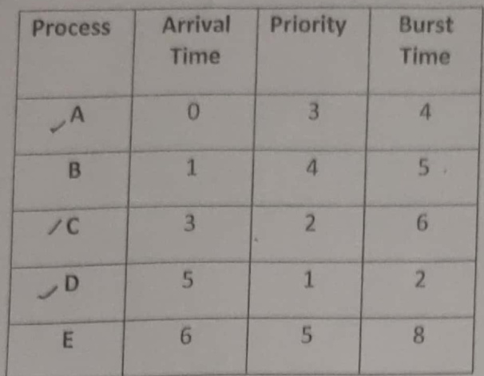
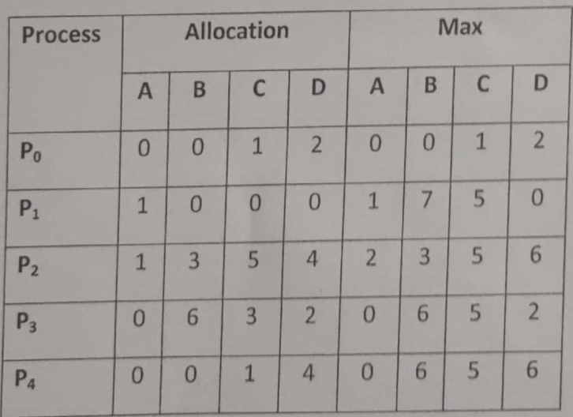
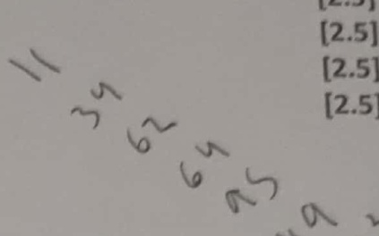

  

Final Assessment Test-Nover  

Course: CSE2005  

Operating System  

Class NBR(s):5658/5660/5661/566Z/3007   
5673/5675/5677/6390/6402/6423/6957  

Time: Three Hours  

PART-A(8X5=40 Marks) Answer ALL Questions  

Operating System is  

(i) Firmware (i) Software (ii) Hardware (iv) Middleware (M)All List out the various services of the Os and brief about each.  

Discuss in detail about the following with suitable sketch  

Task Control Block(TCB)  

Different states of processes and its various methodology for changing their states Compare Message-Passing and Shared-Memory models of Communication.  

"A thread is also called as a Light Weight Process", why?Also mention their benefits.   
Represent the Queuing diagram of process scheduling and explain the same.  

  

With an example synchronization construct, state how “busy waiting wastes Cpu cycles and also present the solution to reduce the wastage of Cpu cycles.  

Distinguish between Paging and segmentation.   
Name the three methods of allocating disk space for file systems.  

c:.ionmomonnartitionsof5k40k.25k.3zk.50kaln004Nii0iuefi0nN0ieceNeneNee4 makes the most efficient use of memory?  

# PART-B(6 $\times10=60$ Marks Answer anySix Questions  

  

What ismean by system call?List out the various system calls in Os& explain its various functions& features.  

Distinguishbetween iSymmetric and Asymmetric multiprocessing iLgng term scheduler and Short term scheduler (ii Multi-programming and Multi-tasking  

  

Draw four Gantt chartilustrating the execution of these processesusingFCFspreemptive SIF,[] non-preemptivePriority (a small prioritynumber implies a higher priority) and RR(Quantum= 2) scheduling.  

iCalculattheaveragewaitingtimeandaverageTurnaroundtimefortheabovechedulingalgorithm.[] aState and explain the drawback of typical “Semaphore” solution to Dining-Philosophers problem with 1[5] pseudo code,alsoprovidea solution toremedy the drawback.  

Write a “Monitor” solution to Bounded-Buffer problem.  

The operating system contains 4resourcesA,B,Cand D the No.of instances of eachresource type is3 14,12 and 12 respectively.The current resource allocation state is as shown below in the table.  

  

LiyTs the current allocation in a safe state? [2] LiCan thereguestmadebyprocess $P_{1}\left(0,4,2,0\right)$ begranted? [2] Gim Check whether the given process execution sequence is safe or unsafe $<P_{0}$ P2P3Pa $P_{3}>$ Supposeitis [6] unsafe give the safe process execution sequence and provide each stage Available & Allocation” strategy.  

13Suppose that a disk drive has200 cylindersnumbered 0to 199.Assume that the disk head starts at cylinder50.The queue of pending requests,inFiFo order,is  

Starting from thecurrent head position,whatisthe total distance (in cylinders）that the disk armmoves to satisfyall the pendingrequestsforeachof thefollowing disk scheduling algorithms?Also assumethe head is moving towards O in SCAN and Circular SCAN.  

First-Come,First-Serve Shortest-Seek-Time-First (ii)SCAN   
(iv) Circular-SCAN  

Consider the following page-reference string  

1,2,3,2,1,5,2,1,6,2,5,6,3,1,3,6,1,2,4,320   
How many Page Miss would occur in the following page replacement algorithms,assuming three page frames?Remember that all frames are initially empty,so your first unique pages will all cost one fault each.   
i Least-Recently-Used   
iYFirst-In-First-Outreplacement   
ijiYOptimalreplacement  

  

Discuss in detail about various issues in security methods provided in modern operating systems.  

5.ExplainaboutParavirtualization,alsomentionthe threetypesof hardwarevirtualizationtechniqueswith suitablesketch.  