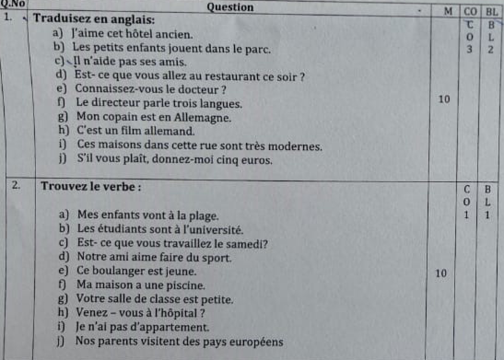
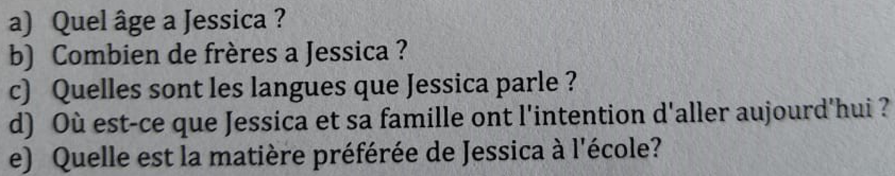

# REG.NO:2|MID0229  

# VIT Vellore Institute ofTechnolog  

HOOLOFSOCIALSCIENCESANDLANGUAGES CONTINUOUSASSESSMENTTEST-II FALLSEMESTER2024-2025  

SLOT:E1  

Programme Name &Branch   
Course Code and Course Name   
Faculty Name(s)   
Class Number(s)   
Date ofExamination   
ExamDuration  

Maximum Marks:50  

Answer All Questions M-Max mark,CO-Course Outcome; BL-Blooms Taxonomy Level [1-Remember,2-Understand,3- Apply.4-Analyse,5-Evaluate,6-Create) Course Outcomes 1.Identify in French language the daily life communicative situations via personal pronouns,emphatie pronouns,salutations,negations and interrogations. 2 Communicate effectively in French language via regular /irregular verbs. 3.Demonstrate comprehension of the spoken/ written language in translating simple sentences. 毛Understand and demonstrate the comprehension of some particular new range of unseen written materials 5.Demonstrate a clear understanding of the French culture throueh the laneuava shudlad  

  

SCHOOLOFSOCIALSCIENCESANDLANGUAGES CONTINUOUSASSESSMENTTEST-II FALLSEMESTER2024-2025  

SLOT:E1  

a) Completez avec les adjectifsdemonstratifs a)Elle est bien, robe. b) Jenaime pas. chemises c） Un bon compagnon, -animal! d) Vous allez a. boutique? e] -sacesten cuir  

# b) Mettez lesphrases au feminin  

a)Mon pere est intelligent.   
b)Mon oncle est blond.   
c)Mon copain est petit.   
d) Mon cousin est triste.   
c)Son grand-pere est gentil  

# a) Choisissezla bonne reponse:  

a)llest bon,(ton/ta)cafe!   
b)(Mes/mon) rendez-vous est a 8 heures.   
c)[sa/ses]euros sont la,surla table!   
d)Quelle est [ta/votre /vos] nationalite,s'il vous plait? e] C'est(mon/ma/ses] livre.  

b) Ecrivez en toutes lettres: 03h45,02h20.16h50.08h30.04h15  

# Lisez le texte et Repondez aux questions:  

Je m'appelle Jessica Je suis une fille.je suis francaise et j'ai treize ans. Je vais a I'ecole a Nice, mais jhabite a Cagnes-Sur-Mer. J'ai deux freres. Le premier sappelleThomas.ila quatorze ans.Le second s'appelle Yann etil a neuf ans. Mon papa est italien et il est fleuriste. Ma mere est allemande et est avocate. Mes freres etmoi parlons francais,italien et allemand a la maison. Nous avons une grande maison avec un chien,un poisson et deux chats. Aujourd’hui,on est samedinous rendons visite a notre grand-mere.Ellea A4ane et elle habite a Antibes. ladore ma grand-mere, elle tres gentille  

# Vellore InstituteofTechnology Deemed to be Lhiversity under secon 3ofuC Aet, 195o  

# SCHOOL OFSOCIALSCIENCESANDLANGUAGES CONTINUOUSASSESSMENTTEST-HI FALLSEMESTER2024-2025  

SLOT:E1  

Elle fait des bons gateaux.  

Lundi, jeretourne a lécole. Je suis contente,je vais voir Amelie. C'est ma meilleure amie. J'aime beaucoup l'ecole. Mes matieres preferees sont le francais et le sport. J'aime beaucoup lire et je nage tres bien.  

Answer to the questions in a complete sentence:  

  