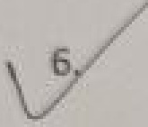
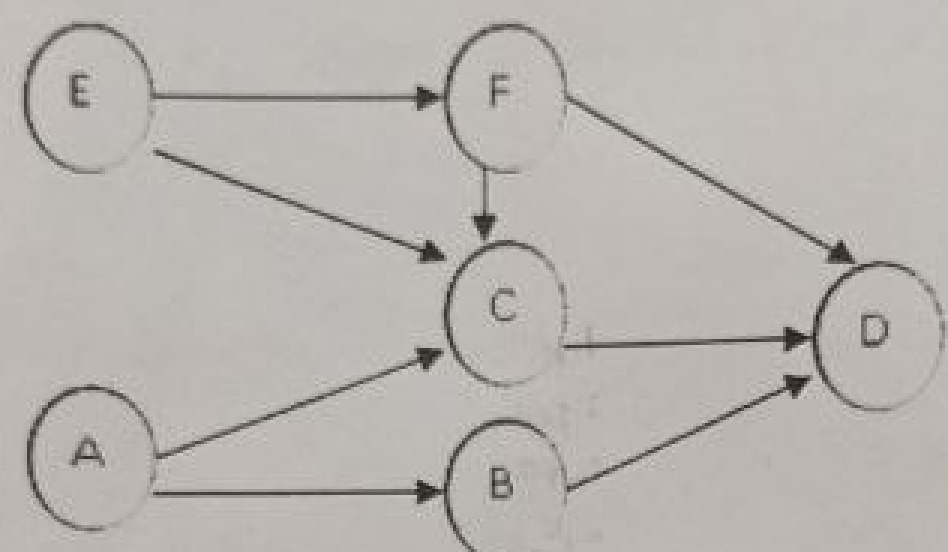
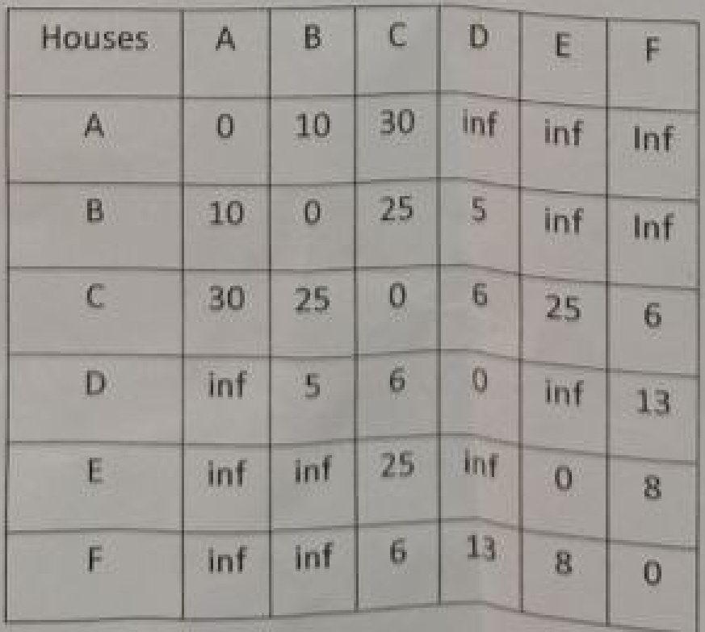

  

Final AssessmentTest-November/December 2023 Course:BCSE202L-Data Structures and Algorithms ClassNBR(s):5396 Slot:E1+TE1 Max.Marks:100 Time:Three Hours  

KEEPINGMOBILEPHONE/MARTWATCHVENINFFOSITIONSTREATEDASEAMMAPRAI Answer anyTENQuestions (10X10=100Marks)  

Calculate the time complexity for thefollowingexpressions byiteration method:  

i)T(n)=2T（n/2)+n2. $T(1)=1$ ii)T(n)=4T(n/2) $\pm\Pi_{i}$ T（1)=1 $T(n)=2T(n-2)+C_{\prime}$ $T(0)=1$  

[3] [3] [4]  

2. Generate therelation/expression oftimecomplexity for the following piece of codeand subsequently calculateits timecomplexity.  

int oper(int a[],int n,int s) if $(n<0)$ return(-1); if(a[n-1] $==5$ return (n-1); else return oper(a,n-2,s);  

A stack ADT operates by push and pop furctions with top being the index pointer. A queue ADT operates by enqueue and dequeue operations with front and rear indexpointers.Implement a queue by using a stack underneath (with array).This means that the enqueue and dequeue functions in turn should call relevant push and pop operations to implement the queue ADT.Write the pseudocode for this enqueue and dequeue operations and justify their correspondingtimecomplexities.  

Generate the contents of the original array after7thcallto themodifiedmerge   
sort function is completed. The input array and the modified merge sort are   
givenbelow:   
Input array:43 39 31354228 20 2730 25   
void modmergesort(int arr[],int l,intr)   
{intm; $(1-i)$ m=(l+r)/2;modmergesort(a,m+1,r); modmergesort(a,l,m); merge(l,m,r);  

Applystacktoconvert thegiveninfixexpressiontoitspostfixexpression "N'representsexponentiation.  

A/B^C\*((D-E)+F)  

Consequentyusethepostixtationtreatenexpressonteeandn perform an inorder traversal of the created expression tree.  

  

  

Perform topological sorting on the above directed graph.  

Now, for performing Depth First Traversal,assume that all the edges in the graph are undirected.Generate,step by step,the resultant output of Depth First Traversal,along with the finishing time for all the vertices, starting from thevertexA.  

NOTE:The adjacencymatrix/listhas the following orderA,D,E,F,C,B.  

The cable company has to put down the cables which can connect all the six houses（A,B,C,D,E,F）and itwishestominimizethecostof cabling.UsePrim algorithm(usingAas the source)to showin a stepby step manner how thiscan be achieved.The resultant connections and the total cost should also be provided.The costmatrix for the houses is given below.A positive value in (i) cell represents a cabling cost between house iand housej,Omeans no cost and inf signifiesno cabling can be done.  

  

canaidera hashingmechanism which acceptsinteger keys, $\mathbb{k}_{\theta}$ Jt.inecalaulatesthehashtablesize.p.astheminimumprie!ywyelwulcl ielargerthanthe numberofkevsentered (foreg-,itthe nuimoer otentriesare sthehashtablesizepis7).Usingtheright2-shittmethoutorTiasrlmgllfwmilcht tworightmostdigitsarerotatedtotheleftand then usedigit extraction (flrst, third,and fifth digit) get the addresses ofthe tollowing keys.Use the linear probe method to resolve collision and report total number of collisions occurredduringtheprocess.  

224562137456214562140145   
214576162145144467123456  

Evaluate the performance (in terms of no.of collisions) of general modular function and subsequent quadraticprobing for the followingkeys having five digits.lf the digit has less than five digits, perform padding on the right side (least significant bits).The hash table size, $F^{1}$ istheminimumprime number larger than thelength oftheinput list.  

The numhers are 2543 71356 25328.23151 131.4217.99929.12345 Demonstrate how a min heap can be used to satisfy the operations ofa priority queue.The priority queue always removes the node with the lowest value (highest priority) while enters a node simply at the end. Simulate schematically how the following entries are added/enqueued (and adjusted) in this priority queue by using a min heap. Show the status of insert enqueue operation.  

12,18,11,7,31,20,45,14and32  

Subsequently perform remove/dequeueoperation twice. Show the adjustments and the subsequent status of the min heap tree after each remove/dequeueoperation.  

11 Create an AVL tree by inserting the following sequence of values while maintaining the height balance of the binary search tree:  

102030408642  

Consequently,delete the keys 8 and 4in sequence from the generated tree.   
Reveal the status of the tree after each insertion and deletion operation.  